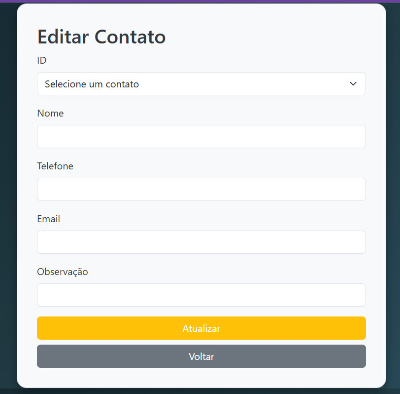
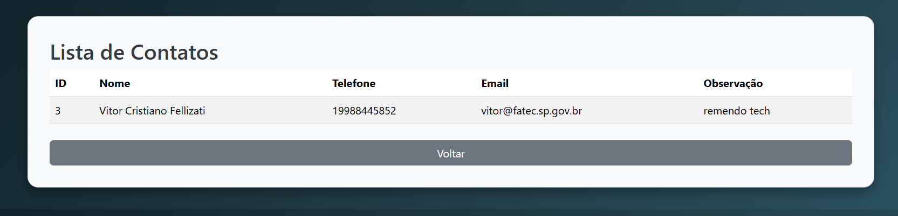
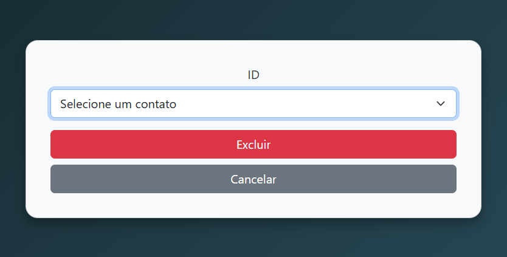
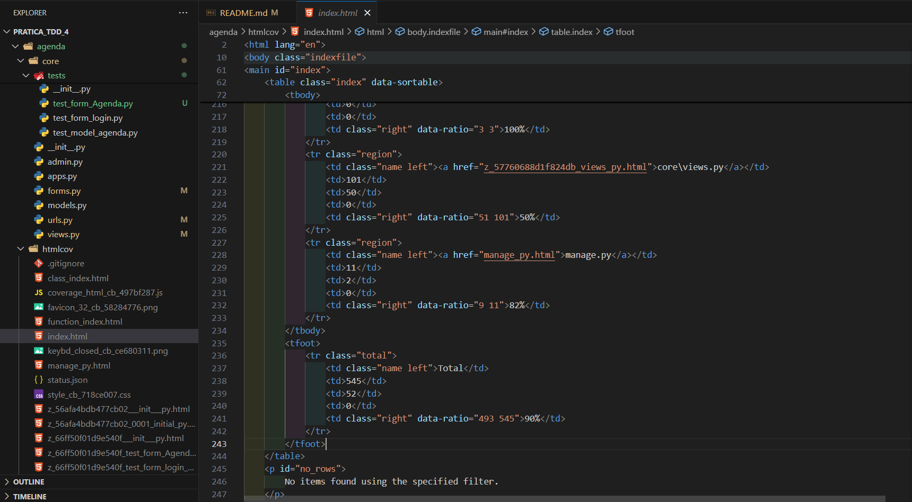

# 🧪 Prática TDD 4 — Agenda de Contatos com Django  

Desafio técnico desenvolvido na disciplina **Desenvolvimento Web 3**, com foco em **Test-Driven Development (TDD)** e **Django Framework**.  

O projeto consiste em uma **Agenda de Contatos** com autenticação e controle de acesso, implementada em duas sprints:  
1. **Sprint 1** – Sistema de login/logout com validação de e-mail institucional.  
2. **Sprint 2** – CRUD completo de contatos (criar, listar, editar e remover), protegido para usuários autenticados.  

---

## 🚀 Tecnologias Utilizadas

- **Python 3.x**
- **Django 5.x**
- **SQLite3** (banco de dados padrão)
- **Virtualenv**
- **Coverage.py** (para análise de cobertura de testes)
- **HTML + CSS (Bootstrap)**

---

## ⚙️ Instalação e Execução do Projeto

### 💻 Ambiente Linux

```bash
git clone https://github.com/jmcardoso18/Pratica_TDD_4
cd Pratica_TDD_4/
virtualenv -p python3 venv
source venv/bin/activate
pip install -r requirements.txt
cd agenda/
python manage.py migrate
python manage.py createsuperuser
python manage.py runserver
```

### 🪟 Ambiente Windows

```bash
git clone https://github.com/jmcardoso18/Pratica_TDD_4
cd Pratica_TDD_4/
virtualenv venv
venv\Scripts\activate
pip install -r requirements.txt
cd agenda/
python manage.py migrate
python manage.py createsuperuser
python manage.py runserver
```

---

## 🔐 Credenciais do Superusuário

| Campo | Valor |
|-------|-------|
| **Username** | `admin` |
| **E-mail** | *seu e-mail institucional (@fatec.sp.gov.br)* |
| **Senha** | `fatec´ |

---
## 🧩 Diagrama de caso e uso
 

## 🧩 Funcionalidades Implementadas

### 🟢 **Sprint 1 – Autenticação e Controle de Acesso**

- Login de usuário utilizando **e-mail institucional** (`@fatec.sp.gov.br`);
- Logout seguro com redirecionamento para a tela inicial;
- Páginas protegidas para acesso restrito de usuários autenticados;
- Testes unitários e de integração com **cobertura acima de 90%**.

**Telas:**

- Tela de Login 


- Tela Index (após login)  


- Tela de Logout  


- Tela de Cadastro


- Tela de Edição  


- Tela de Exibir 


- Tela de delete  
---

### 🔵 **Sprint 2 – CRUD Completo de Contatos**

Foi implementado um **CRUD completo da agenda de contatos**, conforme o modelo de dados definido.

**Funcionalidades:**
- ✅ **Cadastrar contato**  
- ✅ **Listar contatos**  
- ✅ **Editar contato**  
- ✅ **Remover contato**  
- ✅ **Acesso restrito a usuários logados**  
- ✅ **Validação de dados via Django Forms**  

**Modelo de Dados (Agenda):**
```python
class Agenda(models.Model):
    nome = models.CharField(max_length=100)
    telefone = models.CharField(max_length=15)
    email = models.EmailField()
    endereco = models.CharField(max_length=255)
```

---

## 🧪 Testes e Cobertura

Para executar os testes e gerar o relatório de cobertura:

```bash
coverage run --source='.' manage.py test
coverage html
```

Acesse o relatório em:
```
htmlcov/index.html
```

📊 **Cobertura de testes:** acima de **90%** em todas as camadas (views, forms e models).

---

---

## 👩‍💻 Autor(a)

**Jamila M. Cardoso**  
Desenvolvedora Full-Stack em formação  
📧 *[jamila.cardoso@fatec.sp.gov.br]*  

---

## 🧭 Considerações Finais

O projeto **Prática TDD 4** demonstra a aplicação de **boas práticas de desenvolvimento com Django**, **testes automatizados** e **controle de acesso seguro**, consolidando o aprendizado das disciplinas de **Desenvolvimento Web 3** e **Test-Driven Development**.
